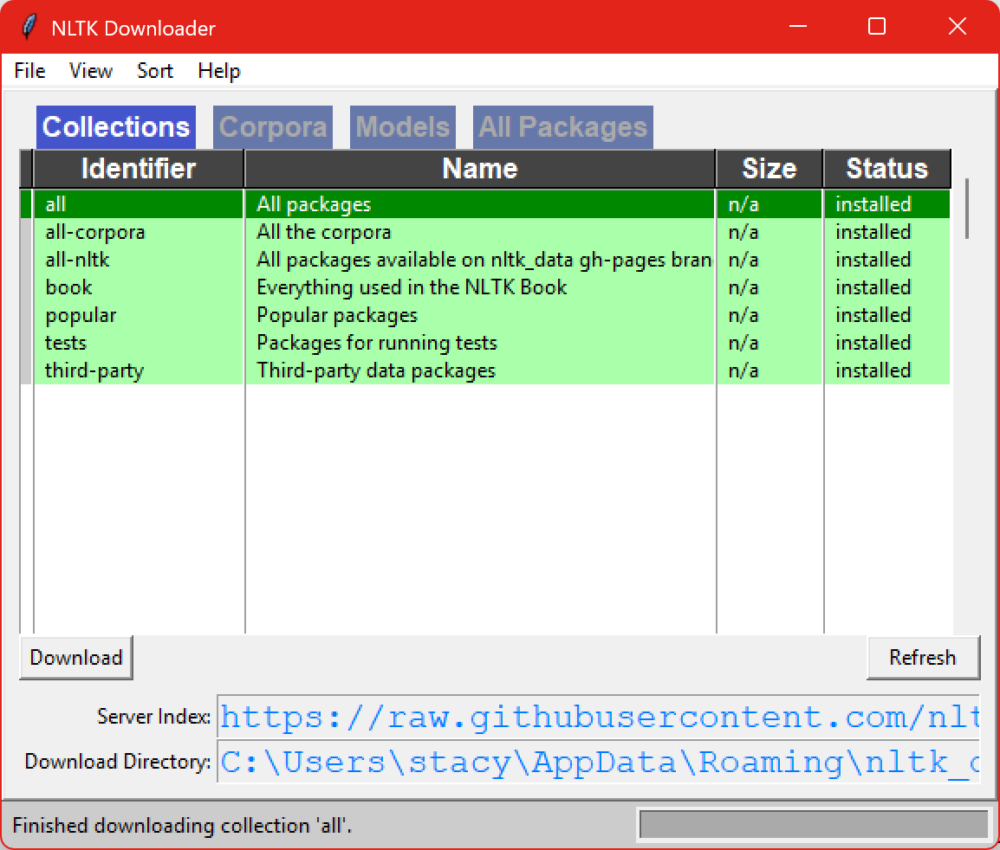

# Understanding AI
Stacy Irwin

Last Updated: 12 April 2026

This repository contains several Marimo notebooks that explain how large language models (LLM) work. The target audience is high school FIRST robotics students who have completed Algebra I and who are familiar with Python, Git, and VS Code.

## Table of Contents
1. Terrminology and Concents: 01-terminology/terminology.md
2. Intro to Machine Learning: 02-machine-learning/machine-learning.md

## System Setup
To run the code in this repo, complete the following steps:
1. Install VS Code. See https://code.visualstudio.com/download.
2. Install Git. See https://git-scm.com/install/windows.
    * Select all default installation options EXCEPT set VS Code as Git's default editor instead of Vim.
3. Use Git to clone this repo.
4. Install UV per the installation instructions at https://docs.astral.sh/uv/getting-started/installation/.
5. From the repo's root folder run `uv sync` to create a virtual environment and install all required dependencies.
6. Activate the virtual environment: `.\venv\Scripts\activate` (Windows) or `source .venv/bin/activate` (Linux or Mac).
7. Some of the Marimo notebooks use the [NLTK Python package](https://www.nltk.org/).
NLTK was installed when you ran ran the `uv sync` command, but NLTK has an additional
setup step.
    * Start the Python interpreter in your terminal by by running `python`. Then
      execute these Python statements.
        * `import nltk`
        * `nltk.download()`
    * Running the `nltk.download()` statement will cause the NLTK downloader dialog to
      pop up. Go to the *Collections* tab, select *all*, then click *Download* to
      download all datasets and tools. The download will take a few minutes. The
      downloader will look like the following figure 1 when the download is done.

## Getting Started
1. Run `marimo edit`
2. Select the desired notebook from the marimo management page.
    * Start with `01-terminology/terminology.py`

## Figures
### Figure 1 - NLTK Downloader
